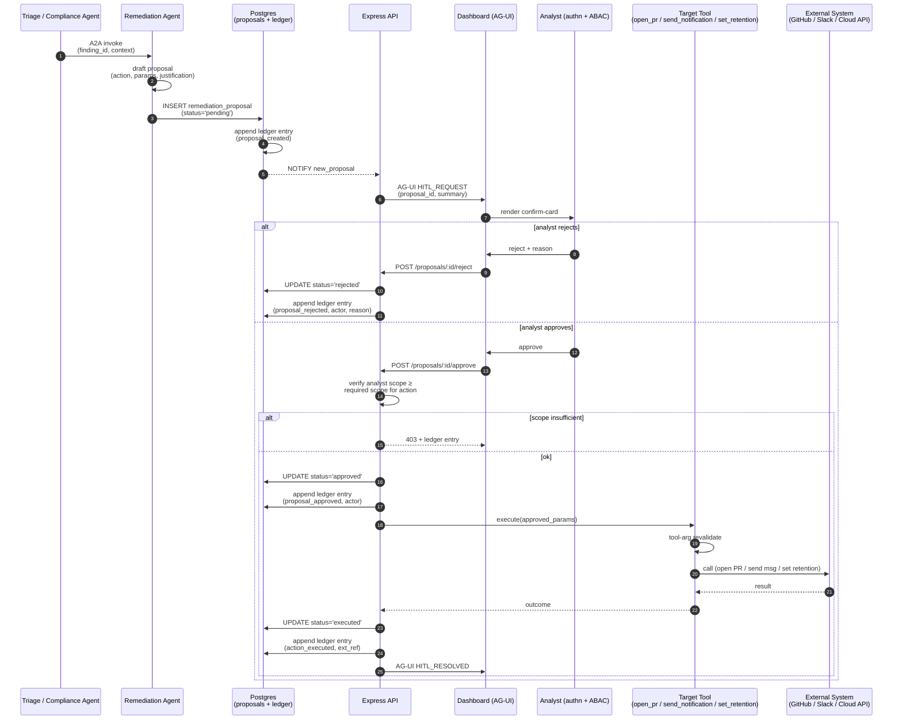
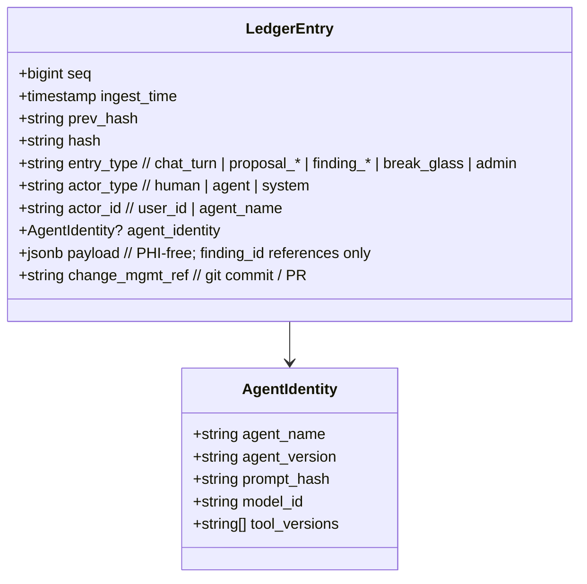

# Diagrams

Mermaid sequence and flow diagrams for the three highest-traffic paths. Render in any Mermaid-aware viewer (GitHub, VS Code, Replit Markdown preview).

## 1. Ingest funnel — log line → finding → ledger

End-to-end path of a single log event from source through to a visible finding. Volumes per `DESIGN_OPTION_D.md` §4.

```mermaid
sequenceDiagram
    autonumber
    participant Src as Log Source<br/>(CloudWatch / GCL / Azure)
    participant Ing as Ingest Worker<br/>(Kafka producer)
    participant WORM as WORM Raw Tier<br/>(Object Lock)
    participant S1 as Stage 1 Detector<br/>(regex / pattern)
    participant S2 as Stage 2 Detector<br/>(clinical NER)
    participant Tri as Triage Agent<br/>(Temporal activity)
    participant Ver as Verifier Agent<br/>(strong model)
    participant DB as Postgres<br/>findings + ledger
    participant Note as Notarization<br/>(separate account)

    Src->>Ing: stream log event
    Ing->>WORM: write raw (Object Lock, source-time)
    Ing->>S1: enqueue (Kafka raw topic)
    S1->>S1: regex / pattern match
    alt no pattern hit
        S1-->>Ing: drop (counted)
    else hit
        S1->>S2: candidate (Kafka candidates topic)
        S2->>S2: NER + policy classify
        alt low confidence
            S2-->>Tri: candidate w/ confidence band
        else high confidence
            S2->>DB: finding (auto-classified)
        end
        S2->>Tri: candidate w/ redacted evidence
        Tri->>Tri: dedup against cluster fingerprint
        alt duplicate of open finding
            Tri->>DB: append evidence to existing
        else novel + low severity
            Tri->>DB: write finding
        else novel + needs verification
            Tri->>Ver: A2A invoke (redacted only)
            Ver->>Ver: classify + score
            Ver->>DB: write finding
        end
        DB->>DB: append ledger entry<br/>(prev_hash → hash, agent identity)
        opt every 1000 entries OR daily
            DB->>Note: notarize head hash<br/>(signed, Object Lock)
        end
    end
```

**Notes:**
- Steps 1–4 are deterministic; no LLM touches raw content here.
- Stage 1+2 are the **only** components that see raw content. Everything past Triage sees redacted only.
- The Triage → Verifier hop is A2A; Verifier's tool allow-list excludes write tools.
- Ledger writes are transactional with finding writes (single PG transaction with advisory lock).

---

## 2. Chat turn — analyst question → cited streamed answer

A single chat turn from UI submit to ledgered completion, end-to-end. AG-UI events on SSE.

```mermaid
sequenceDiagram
    autonumber
    participant UI as Browser (React)
    participant API as Express API<br/>(/chat/.../messages SSE)
    participant Auth as Session / RLS
    participant Chat as Chat Agent<br/>(Gemini via Replit AI in dev)
    participant Reg as ToolRegistry<br/>(MCP)
    participant View as findings_redacted view
    participant Scan as Output PHI Scanner
    participant DB as Postgres ledger

    UI->>API: POST /messages { content }
    API->>Auth: verify signed cookie + load claims
    Auth-->>API: ok, set RLS GUC vars
    API-->>UI: SSE open<br/>RUN_STARTED (run_id)
    API->>Chat: invoke(prompt, allow_listed_tools)

    Note over Chat: Role-isolated prompt;<br/>untrusted content tagged

    loop until final answer OR max_iter
        Chat->>API: stream TEXT_MESSAGE_*
        API-->>UI: forward events
        alt tool call needed
            Chat->>API: TOOL_CALL_REQUEST<br/>(get_finding F-001)
            API->>Reg: lookup + revalidate args<br/>against policy layer
            alt args reject
                Reg-->>Chat: tool_error
            else ok
                Reg->>View: SELECT under RLS
                View-->>Reg: redacted row
                Reg-->>Chat: TOOL_CALL_RESULT
            end
            API-->>UI: forward TOOL_CALL_* events
        end
    end

    Chat-->>API: final draft
    API->>Scan: scan final output
    alt PHI detected in output
        Scan-->>API: REDACT + emit self-finding
        API-->>UI: TEXT_MESSAGE_REDACTED
    else clean
        Scan-->>API: ok
        API-->>UI: TEXT_MESSAGE_FINAL
    end

    API-->>UI: RUN_FINISHED
    API->>DB: append ledger entry<br/>{ session, user, prompt_hash,<br/>agent_id, model_id, tool_calls,<br/>citations, token_spend }
```

**Notes:**
- The RLS step binds the PG session to the caller; the agent literally cannot read rows outside scope.
- Tool-arg revalidation runs **before** the view query — schema-valid args can still be policy-rejected.
- Output PHI scan is the final guard; a leak there is itself a finding *about the Chat Agent*.
- Heartbeat events (every 15 s) keep the Replit proxy from buffering; not shown.

---

## 3. HITL remediation — proposal → approval → action

A write action (open redaction PR / send notification / configure log group) is always proposed first, then approved by a human with matching scope.



**Notes:**
- The agent **never** invokes the target tool directly — only writes a proposal row.
- Approval requires the analyst's scope to be at least the required scope for the action (defined per tool).
- Outbound PHI guard on `send_notification` runs inside the target tool's revalidation step.
- Every state transition (created / rejected / approved / executed / failed) is a separate ledger entry — full audit reconstruction from the ledger alone.

---

## 4. Step-up auth → break-glass grant → raw-PHI read (M1.6)

The only path that returns unredacted finding evidence. Three separate authorization acts; per-access ledgering.

```mermaid
sequenceDiagram
    autonumber
    participant Analyst
    participant API as Express API
    participant Auth as auth.ts<br/>(HMAC cookies)
    participant DB as Postgres<br/>(break_glass_grants + findings + ledger)

    Note over Analyst,DB: Pre-req: analyst has a valid session cookie (phia_session)

    Analyst->>API: POST /api/auth/step-up<br/>{ token }
    API->>API: rate-limit per IP (5/min)
    API->>Auth: verify token (dev: STEP_UP_DEV_TOKEN<br/>prod: TOTP/WebAuthn/IdP)
    alt token invalid
        API-->>Analyst: 401
        API->>DB: ledger: auth.step_up_denied
    else token valid
        Auth->>Auth: sign phia_stepup cookie<br/>(HMAC tag = "stepup",<br/>domain-separated from session)
        API-->>Analyst: 204 + Set-Cookie phia_stepup (5 min)
        API->>DB: ledger: auth.step_up_granted
    end

    Analyst->>API: POST /api/admin/break-glass/grants<br/>{ findingId, justification }
    API->>API: requireSession + requireStepUp
    API->>API: rate-limit per user (10/min)
    API->>API: validate justification ≥ 10 chars,<br/>findingId matches [A-Za-z0-9_-]{1,64}
    API->>DB: INSERT break_glass_grants<br/>(user_id, finding_id, expires_at = now + ≤15 min)
    API->>DB: ledger: break_glass.granted<br/>(payload: finding_id, expires_at, justification)
    API-->>Analyst: 201 { grantId, expiresAt }

    loop while grant valid
        Analyst->>API: GET /api/admin/findings/:id/raw
        API->>API: requireSession  (NO step-up needed — grant IS the gate)
        API->>DB: SELECT grant WHERE user_id=? AND finding_id=?<br/>AND expires_at > now()
        alt no active grant
            API-->>Analyst: 403
        else grant valid
            API->>DB: SELECT * FROM findings<br/>(only call site that bypasses findingSafeColumns)
            API->>DB: ledger: break_glass.raw_phi_accessed<br/>(payload: finding_id, grant_id; NO raw values)
            API-->>Analyst: 200 { ...FindingSafe, rawEvidence }
        end
    end
```

**Notes:**
- The session cookie and step-up cookie share `SESSION_SECRET` but use per-purpose HMAC tags (`session` vs `stepup`), so neither can be replayed as the other.
- The grant — not step-up — gates raw reads. This means a 5-min step-up window can produce a 15-min raw-read window for one specific finding; the trade-off is explicit and ledgered.
- `break_glass.raw_phi_accessed` fires on **every** read inside the window, not just on grant. Satisfies threat_model §Repudiation "every break-glass access ledgered".
- Policy violations on `validateToolArgs` (canary in tool args, PHI in tool args, oversize, malformed id) go through the same single-writer ledger path (`agent.canary_in_tool_args` / `agent.tool_args_policy_violation`); see §3 above for the tool-arg revalidate step.

---

## 5. Optional — agent identity & ledger entry shape (reference)

Reference shape for what each ledger entry carries. Not a flow — kept here for cross-doc lookup.


